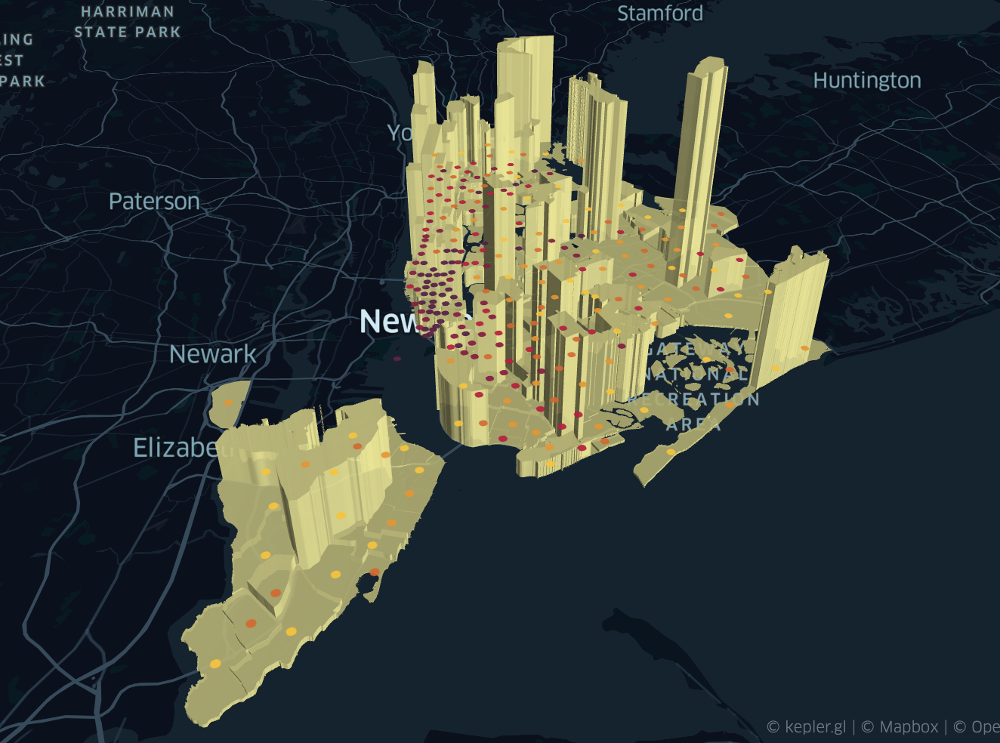

# Final Project for Group 25 for IEOR4501

## UNIs List【mc5266,sj3213】

## Introduction

This project uses requests, pandas, sqlite3 and other libraries to download, clean and visualize data. The data has three parts: the first part is a sample of Uber rides from 01-2009 through 06-2015, the second part is Yellow Taxi trip data from 01-2009 through 06-2015 can be downloaded from [here](https://www1.nyc.gov/site/tlc/about/tlc-trip-record-data.page), and the third part is Historical weather data from 01-2009 through 06-2015 can be downloaded from [here](https://www.ncei.noaa.gov/access/search/data-search/local-climatological-data?stations=72505394728).

## Installation

```shell
conda create -n trips python=3.9 -y
conda activate trips
pip install -r requirements.txt
```

## Data

- Yellow Taxi trip data can be programmatically downloaded.
- Uber sample data should be manually put under the root directory of the project.
- Weather data should be manually put under the root directory of the project.
- Taxi_zone.zip should be manually put under the root directory of the project.

## Usage

All codes are in the [Project.ipynb](Project.ipynb) file. You can run the code after installing the required libraries.

## The Heatmap for Visualization 4



## Division of Labor

Chenmeijia is responsible for part 1,2 and a part of extra credit.
Shangshujin is responsible for part 3,4 and a part of extra credit.

Git statistics are problematic because git does not accurately count the increase and decrease of jupyter notebook, especially when it counts cell output. The actual number of lines added by the two team members was basically equal.